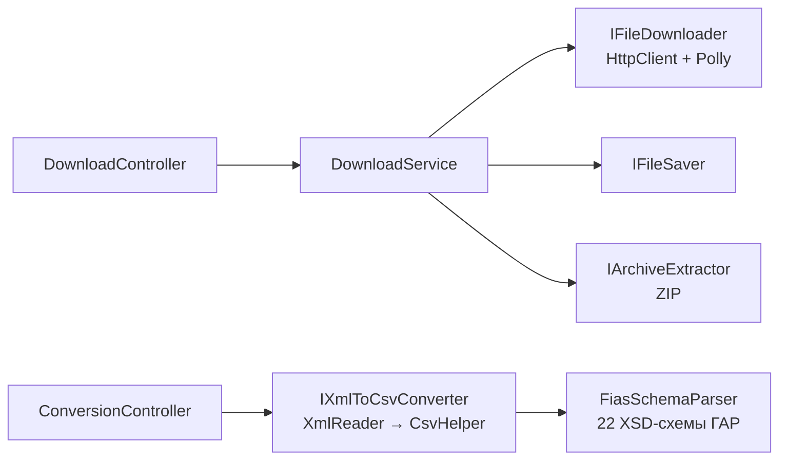

# FiasXMLToCSV

Web API на ASP.NET Core: скачивает дельта-выгрузку ГАР ФИАС с сайта ФНС, распаковывает
архив и конвертирует XML-файлы в CSV. Состав и порядок колонок берутся из XSD-схем ГАР.

.NET 8 · ASP.NET Core Web API · XmlReader, XmlSchemaSet · CsvHelper · Polly · Swagger

## API

| Метод | Путь | Что делает |
|---|---|---|
| `GET` | `/api/download/fias` | скачивает `gar_delta_xml.zip` по адресу из конфигурации и распаковывает |
| `POST` | `/api/conversion/xml-to-csv?xmlPath=…&csvPath=…` | конвертирует один файл |
| `POST` | `/api/conversion/directory?xmlDirectory=…&csvDirectory=…` | конвертирует все XML-файлы каталога |



## Решения

### Колонки из XSD, а не из данных

22 схемы ГАР компилируются в `XmlSchemaSet`, и для каждого корневого элемента из атрибутов
его типа строится список колонок. В XML ГАР необязательные атрибуты у записи просто
отсутствуют: если строить заголовок по первой записи, часть полей потеряется, а порядок
колонок будет плавать между файлами. Для файлов без схемы колонки берутся из первой записи.

### Потоковое чтение

XML читается `XmlReader` в асинхронном режиме: файлы ГАР бывают многогигабайтными
и целиком в память не загружаются. CSV пишет CsvHelper — экранирование кавычек
и разделителей на нём, а не на ручной склейке строк.

### Устойчивая загрузка

Типизированный `HttpClient` с политикой повторов Polly: до 5 попыток с растущей паузой
(2 с × номер попытки), таймаут 10 минут, TLS 1.2/1.3, автоматическая декомпрессия,
пересоздание соединений раз в 2 минуты. Проверку сертификата можно отключить только
в окружении Development и только явным флагом в конфигурации.

### Отмена и ошибки

`CancellationToken` проходит через всю цепочку. Если клиент отменил запрос, API отвечает
`499`, отсутствующий файл — `404`, остальные ошибки логируются и возвращаются как `500`
с описанием.

### Шаги за интерфейсами

Загрузка, сохранение, распаковка и конвертация — отдельные интерфейсы, собранные в DI.
Любой шаг заменяется без правки остальных: например, распаковку можно перенести в поток
без промежуточного файла.

## Запуск

```bash
dotnet run --project FiasXMLToCSV.Server
```

Swagger открывается по адресу `/swagger`.

| Настройка | По умолчанию | Назначение |
|---|---|---|
| `FiasDownload:Url` | `https://fias.nalog.ru/Public/Downloads/Actual/gar_delta_xml.zip` | откуда качать дельту |
| `FiasDownload:DownloadPath` | `Downloads` | куда сохранять архив и распаковку |
| `FiasDownload:MaxRetries` | `5` | число попыток загрузки |
| `FiasDownload:RetryDelayMs` | `2000` | базовая пауза между попытками |
| `FiasSettings:SchemaPath` | `gar_schemas` | каталог XSD-схем |

## Статус

Рабочий сервис. Тестовый проект заведён, тестов пока нет.
